# 🏗️ Talent AI - System Architecture

## Overview

Talent AI is a modern web application built with a decoupled architecture, featuring a Python/FastAPI backend for web scraping and data processing, and a React frontend for user interaction and data visualization.

## System Components

### 🎨 Frontend Layer (React)

```
frontend/
├── Components Architecture
│   ├── App.js                 # Main application orchestrator
│   ├── SearchPanel.js          # Company search & quick-start interface
│   ├── JobsTable.js           # Paginated job listings with filtering
│   └── Analytics.js           # Data visualization dashboard
│
├── State Management
│   ├── Local Component State   # useState for UI state
│   ├── Props Drilling          # Parent-child data flow
│   └── Session Storage         # Recent companies cache
│
└── Styling System
    ├── CSS Variables           # Design tokens
    ├── Component CSS           # Scoped styles
    └── Responsive Design       # Mobile-first approach
```

### 🔧 Backend Layer (FastAPI)

```
backend/
├── API Layer
│   ├── FastAPI Routes          # RESTful endpoints
│   ├── CORS Middleware         # Cross-origin handling
│   └── Request Validation      # Pydantic models
│
├── Scraping Engine
│   ├── Playwright Browser      # Headless Chrome automation
│   ├── BeautifulSoup Parser    # HTML extraction
│   └── Pattern Recognition     # Smart element detection
│
└── Data Processing
    ├── Analytics Engine        # Statistical calculations
    ├── Export Formatter        # JSON/CSV generation
    └── Storage Manager         # File-based persistence
```

## Data Flow Architecture

```mermaid
graph TD
    A[User Interface] -->|HTTP Request| B[FastAPI Server]
    B --> C{Route Handler}
    C -->|/scrape| D[Scraping Engine]
    C -->|/companies| E[Storage Manager]
    C -->|/analytics| F[Analytics Engine]
    C -->|/export| G[Export Formatter]

    D --> H[Playwright Browser]
    H --> I[Greenhouse Site]
    I --> J[HTML Response]
    J --> K[BeautifulSoup Parser]
    K --> L[Data Extraction]
    L --> M[Job Data Model]

    M --> N[Storage]
    M --> F
    F --> O[Statistics]
    O -->|JSON Response| A

    style A fill:#ee7335
    style B fill:#291611
    style H fill:#c7b299
```



## Component Details

### Frontend Architecture

#### Component Hierarchy
```
App.js
├── Header
├── Navigation Tabs
├── SearchPanel
│   ├── Search Form
│   ├── Quick-Start Buttons
│   └── Recent Companies
├── JobsTable
│   ├── Filter Input
│   ├── Table Headers (sortable)
│   ├── Job Rows
│   └── Action Buttons
└── Analytics
    ├── Statistics Cards
    ├── Department Chart
    ├── Location Chart
    └── Salary Chart
```

#### State Management Pattern
```javascript
// App.js - Central State
const [jobs, setJobs] = useState([])
const [analytics, setAnalytics] = useState(null)
const [loading, setLoading] = useState(false)
const [activeTab, setActiveTab] = useState('search')

// Props Flow
<SearchPanel onScrape={handleScrape} />
<JobsTable jobs={jobs} />
<Analytics data={analytics} />
```

### Backend Architecture

#### Request Processing Pipeline
```python
# 1. Request Reception
@app.post("/scrape")
async def scrape_endpoint(request: ScrapeRequest):

    # 2. Validation
    validate_greenhouse_url(request.company_url)

    # 3. Scraping Execution
    scraper = TalentScraper()
    await scraper.initialize()
    jobs = await scraper.scrape_greenhouse_jobs(url)

    # 4. Data Processing
    analytics = calculate_analytics(jobs)

    # 5. Storage
    save_to_json(company_name, jobs, analytics)

    # 6. Response
    return ScrapeResponse(jobs=jobs, analytics=analytics)
```

#### Scraping Engine Architecture
```python
class TalentScraper:
    def __init__(self):
        self.browser = None
        self.context = None

    async def scrape_greenhouse_jobs(self, url):
        # 1. Page Navigation
        await page.goto(url)

        # 2. Element Detection
        job_elements = await find_job_elements(page)

        # 3. Data Extraction
        for element in job_elements:
            job = await parse_job_element(element)

            # 4. Detail Fetching (if needed)
            if not job.salary:
                details = await scrape_job_details(job.url)

        return jobs
```

## Technology Stack

### Frontend Stack
- **React 18.2** - UI framework
- **Chart.js 4.x** - Data visualization
- **Axios** - HTTP client
- **CSS3** - Styling with custom properties
- **JetBrains Mono** - Typography

### Backend Stack
- **Python 3.8+** - Core language
- **FastAPI** - Web framework
- **Playwright** - Browser automation
- **BeautifulSoup4** - HTML parsing
- **Pandas** - Data manipulation
- **Uvicorn** - ASGI server

## Performance Optimizations

### Frontend Optimizations
1. **Lazy Loading**: Components load on-demand
2. **Memoization**: Chart configurations cached
3. **Debounced Search**: Filter input debounced
4. **Virtual Scrolling**: Large job lists virtualized

### Backend Optimizations
1. **Concurrent Scraping**: Up to 20 parallel job detail fetches
2. **Connection Pooling**: Reused browser contexts
3. **Smart Caching**: Session-based result storage
4. **Selective Parsing**: Only parse needed elements

## Scalability Considerations

### Horizontal Scaling
```
Load Balancer
    ├── FastAPI Instance 1
    ├── FastAPI Instance 2
    └── FastAPI Instance 3
         └── Shared Storage (Redis/S3)
```

### Vertical Scaling
- Increase concurrent scraping limits
- Expand browser pool size
- Optimize memory usage with streaming

## Security Architecture

### Input Validation
```python
# URL Validation
def validate_greenhouse_url(url: str):
    parsed = urlparse(url)
    if parsed.netloc != 'job-boards.greenhouse.io':
        raise ValueError("Invalid Greenhouse URL")
```

### CORS Configuration
```python
app.add_middleware(
    CORSMiddleware,
    allow_origins=["http://localhost:3100"],
    allow_methods=["GET", "POST"],
    allow_headers=["*"],
)
```

### Data Sanitization
- HTML content stripped before storage
- User inputs validated with Pydantic
- SQL injection prevention (if DB added)

## Deployment Architecture

### Development Environment
```bash
# Backend
uvicorn app:app --reload --host 0.0.0.0 --port 8100

# Frontend
PORT=3100 npm start
```

### Production Environment
```bash
# Docker Compose
services:
  backend:
    build: ./backend
    ports: ["8100:8100"]

  frontend:
    build: ./frontend
    ports: ["80:80"]

  nginx:
    image: nginx
    volumes: ["./nginx.conf:/etc/nginx/nginx.conf"]
```

## Monitoring & Logging

### Application Metrics
- Request/response times
- Scraping success rates
- Error frequencies
- Memory usage

### Logging Strategy
```python
import logging

logger = logging.getLogger(__name__)
logger.setLevel(logging.INFO)

# Structured logging
logger.info(f"Scraping {company_url}", extra={
    "company": company_name,
    "job_count": len(jobs),
    "duration": elapsed_time
})
```

## Future Architecture Enhancements

### Phase 1: Database Integration
```
PostgreSQL Database
├── jobs table
├── companies table
├── analytics table
└── user_sessions table
```

### Phase 2: Queue System
```
Redis Queue
├── Scraping tasks
├── Export tasks
└── Analytics calculations
```

### Phase 3: Microservices
```
API Gateway
├── Scraping Service
├── Analytics Service
├── Export Service
└── Notification Service
```

## Error Handling Strategy

### Frontend Error Boundaries
```javascript
class ErrorBoundary extends React.Component {
  componentDidCatch(error, errorInfo) {
    logErrorToService(error, errorInfo)
  }
}
```

### Backend Error Handling
```python
@app.exception_handler(Exception)
async def global_exception_handler(request, exc):
    logger.error(f"Unhandled exception: {exc}")
    return JSONResponse(
        status_code=500,
        content={"error": "Internal server error"}
    )
```

## Testing Architecture

### Frontend Testing
- **Unit Tests**: Jest + React Testing Library
- **Integration Tests**: Cypress
- **Visual Regression**: Percy

### Backend Testing
- **Unit Tests**: pytest
- **Integration Tests**: pytest + httpx
- **E2E Tests**: Playwright

## Development Workflow

### Git Branch Strategy
```
main
├── develop
│   ├── feature/new-scraper
│   ├── feature/analytics-v2
│   └── fix/salary-parsing
└── release/v1.1.0
```

### CI/CD Pipeline
```yaml
steps:
  - lint
  - test
  - build
  - deploy-staging
  - deploy-production
```

---

This architecture is designed for maintainability, scalability, and performance while keeping the initial implementation simple and focused.